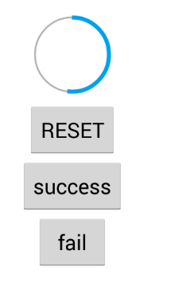

TH-ProgressButton
============

#HOW TO USE:

1. ##Layout:
                       
        <com.thbs.progressbutton.MasterLayout
                android:id="@+id/MasterLayout01"
                android:layout_width="wrap_content"
                android:layout_height="wrap_content"
                android:clickable="true">
    	</com.thbs.progressbutton.MasterLayout>
2. ##Activity
        masterLayout.setOnClickListener(new OnClickListener() {
            @Override
            public void onClick(View v) {
                masterLayout.starShow();
                if (masterLayout.isUnStartModel()) {

					//start to do something;
                }

                if (masterLayout.isSuccessFinishModel()) {
					//do something
                }
            }
        });
3. ##Updating the progress
 
 		masterLayout.updateProgress(progress[0]);
        
        
        
----

很多时候以为自己在写程序，实际被逼着写各种特效。
